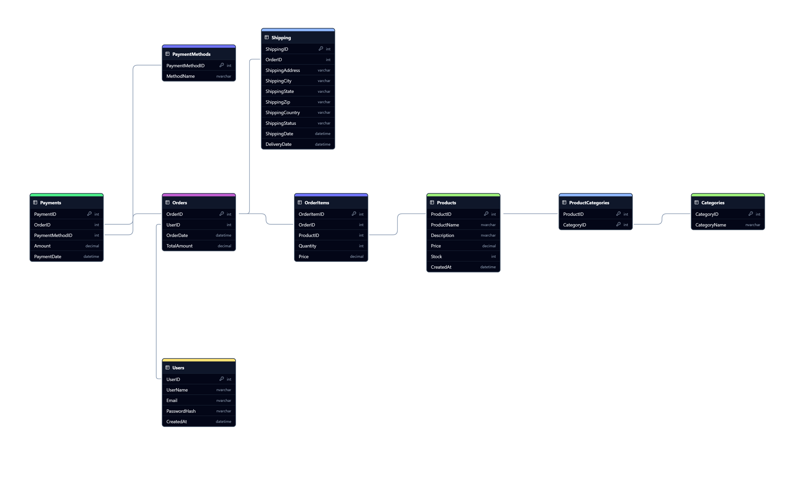

*A comprehensive SQL-based system that ensures efficient data retrieval, robust transaction management, providing a reliable backbone for e-commerce operations.*

# Use Case: E-commerce Database Management System

## **Objective:**
To design and implement a robust database management system for an e-commerce platform using SQL. The system aims to efficiently manage various aspects of the online store, including product listings, customer information, orders, payments, and inventory.

## Key Features
1. **Products**: Manage details of products available for sale.
2. **Categories**: Organize products into categories for easy navigation.
3. **Customers**: Store customer profiles and contact information.
4. **Orders**: Track customer orders and their statuses.
5. **Payments**: Manage payment transactions and methods.
6. **Inventory**: Track stock levels and manage inventory.
7. **Reviews**: Capture customer feedback and ratings for products.

## Entities and Schema



1. **Database Tables:**
```sql

-- Users

CREATE TABLE Users (
    UserID INT PRIMARY KEY IDENTITY(1,1),
    UserName NVARCHAR(50) NOT NULL,
    Email NVARCHAR(100) NOT NULL UNIQUE,
    PasswordHash NVARCHAR(255) NOT NULL,
    CreatedAt DATETIME DEFAULT GETDATE()
);

-- Products 

CREATE TABLE Products (
    ProductID INT PRIMARY KEY IDENTITY(1,1),
    ProductName NVARCHAR(100) NOT NULL,
    Description NVARCHAR(MAX),
    Price DECIMAL(10, 2) NOT NULL,
    Stock INT NOT NULL,
    CreatedAt DATETIME DEFAULT GETDATE()
);

-- Categories

CREATE TABLE Categories (
    CategoryID INT PRIMARY KEY IDENTITY(1,1),
    CategoryName NVARCHAR(50) NOT NULL
);-- Users

CREATE TABLE Users (
    UserID INT PRIMARY KEY IDENTITY(1,1),
    UserName NVARCHAR(50) NOT NULL,
    Email NVARCHAR(100) NOT NULL UNIQUE,
    PasswordHash NVARCHAR(255) NOT NULL,
    CreatedAt DATETIME DEFAULT GETDATE()
);

-- Products 

CREATE TABLE Products (
    ProductID INT PRIMARY KEY IDENTITY(1,1),
    ProductName NVARCHAR(100) NOT NULL,
    Description NVARCHAR(MAX),
    Price DECIMAL(10, 2) NOT NULL,
    Stock INT NOT NULL,
    CreatedAt DATETIME DEFAULT GETDATE()
);

-- Categories

CREATE TABLE Categories (
    CategoryID INT PRIMARY KEY IDENTITY(1,1),
    CategoryName NVARCHAR(50) NOT NULL
);
```

2. **Indexing:**
```sql
-- Adding Indexes

CREATE INDEX IDX_Users_Email ON Users(Email);
CREATE INDEX IDX_Products_ProductName ON Products(ProductName);
CREATE INDEX IDX_Orders_UserID ON Orders(UserID);
CREATE INDEX IDX_Shipping_OrderID ON Shipping(OrderID);
CREATE INDEX IDX_Shipping_ShippingStatus ON Shipping(ShippingStatus);
```
3. **Add a New Product:**
```sql
CREATE PROCEDURE AddProduct
    @ProductName NVARCHAR(100),
    @Description NVARCHAR(MAX),
    @Price DECIMAL(10, 2),
    @Stock INT
AS
BEGIN
    INSERT INTO Products (ProductName, Description, Price, Stock)
    VALUES (@ProductName, @Description, @Price, @Stock);
END;
```

4. **Update Product Stock:**
```sql
CREATE PROCEDURE UpdateProductStock
    @ProductID INT,
    @Stock INT
AS
BEGIN
    UPDATE Products
    SET Stock = @Stock
    WHERE ProductID = @ProductID;
END;
```

5. **Place an Order:**
```sql
CREATE PROCEDURE PlaceOrder
    @UserID INT,
    @TotalAmount DECIMAL(10, 2),
    @OrderItems dbo.OrderItemType READONLY
AS
BEGIN
    SET NOCOUNT ON;
    DECLARE @OrderID INT;

    BEGIN TRY
        BEGIN TRANSACTION;

        INSERT INTO Orders (UserID, TotalAmount)
        VALUES (@UserID, @TotalAmount);

        SET @OrderID = SCOPE_IDENTITY();

        INSERT INTO OrderItems (OrderID, ProductID, Quantity, Price)
        SELECT @OrderID, ProductID, Quantity, Price
        FROM @OrderItems;

        COMMIT TRANSACTION;
    END TRY
    BEGIN CATCH
        ROLLBACK TRANSACTION;
        THROW;
    END CATCH
END;
```

6. **Add Payment:**
```sql
CREATE PROCEDURE AddPayment
    @OrderID INT,
    @PaymentMethodID INT,
    @Amount DECIMAL(10, 2)
AS
BEGIN
    INSERT INTO Payments (OrderID, PaymentMethodID, Amount, PaymentDate)
    VALUES (@OrderID, @PaymentMethodID, @Amount, GETDATE());
END;
```

7. **Add a Customer Review:**
```sql
CREATE PROCEDURE AddReview
    @ProductID INT,
    @UserID INT,
    @Rating INT,
    @Comment NVARCHAR(MAX)
AS
BEGIN
    INSERT INTO Reviews (ProductID, UserID, Rating, Comment, ReviewDate)
    VALUES (@ProductID, @UserID, @Rating, @Comment, GETDATE());
END;
```

### Benefits
- **Efficient Data Management**: Streamlined handling of product, customer, and order information.
- **Scalability**: The system can easily scale to accommodate growing data volumes.
- **Data Integrity**: Referential integrity and data validation ensure accurate and reliable data.
- **Performance**: Optimized queries for fast data retrieval and transaction processing.

**Benefits of Using an SQL-Based Ecommerce Database:**

* **Scalability:** Easily handle increasing product catalogs and customer base.
* **Flexibility:** Customize the database to meet specific business needs.
* **Performance:** Optimize database queries for fast response times.
* **Security:** Protect sensitive customer and financial data.
* **Reliability:** Ensure data integrity and availability.

By effectively managing the ecommerce database, businesses can streamline operations, improve customer satisfaction, and drive sales growth.